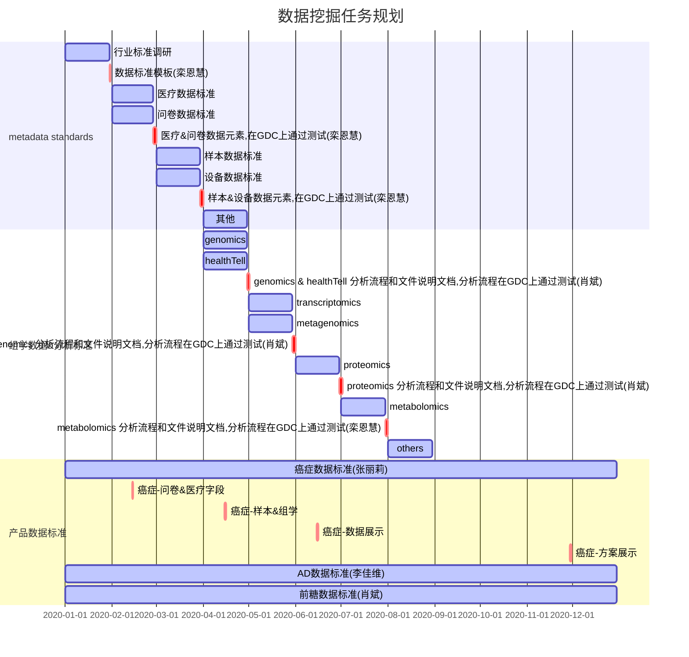

# Activities
活动总结，活动计划

## 2020活动

```mermaid
gantt
       dateFormat  YYYY-MM-DD
       title 数据挖掘任务规划

       section metadata standards
       行业标准调研              :active,    des1, 2020-01-01,2020-01-30
       数据标准模板(栾恩慧)              :crit, 1d
       医疗数据标准              :active,    des2, 2020-02-01, 2020-02-28
       问卷数据标准              :active,    des3, 2020-02-01, 2020-02-28
       医疗&问卷数据元素,在GDC上通过测试(栾恩慧): crit, 2d
       样本数据标准              :active,    des4, 2020-03-01, 2020-03-30
       设备数据标准              :active,    des5, 2020-03-01, 2020-03-30
       样本&设备数据元素,在GDC上通过测试(栾恩慧): crit, 2d
       其他                      :active,    des6, 2020-04-01, 2020-04-30

       section 组学数据&分析标准
       genomics                  :active,  2020-04-01, 2020-04-30
       healthTell                :active,  2020-04-01, 2020-04-30
       genomics & healthTell 分析流程和文件说明文档,分析流程在GDC上通过测试(肖斌) :crit, 2d
       transcriptomics           :active,  2020-05-01, 2020-05-30
       metagenomics              :active,  2020-05-01, 2020-05-30
       transcriptomics & metagenomics 分析流程和文件说明文档,分析流程在GDC上通过测试(肖斌) :crit, 2d
       proteomics                :active,  2020-06-01, 2020-06-30
       proteomics 分析流程和文件说明文档,分析流程在GDC上通过测试(肖斌) :crit, 2d
       metabolomics              :active,  2020-07-01, 2020-07-30
       metabolomics 分析流程和文件说明文档,分析流程在GDC上通过测试(栾恩慧) :crit, 2d
       others                    :active,  2020-08-01, 2020-08-30
       
       section 产品数据标准
       癌症数据标准(张丽莉)      :active, 2020-01-01, 2020-12-30
       癌症-问卷&医疗字段        :crit, 2020-02-14, 2020-02-15
       癌症-样本&组学            :crit, 2020-04-15, 2020-04-16
       癌症-数据展示             :crit, 2020-06-15, 2020-06-16
       癌症-方案展示             :crit, 2020-11-29, 2020-11-30
       AD数据标准(李佳维)        :active, 2020-01-01, 2020-12-30
       前糖数据标准(肖斌)        :active, 2020-01-01, 2020-12-30
       
```
