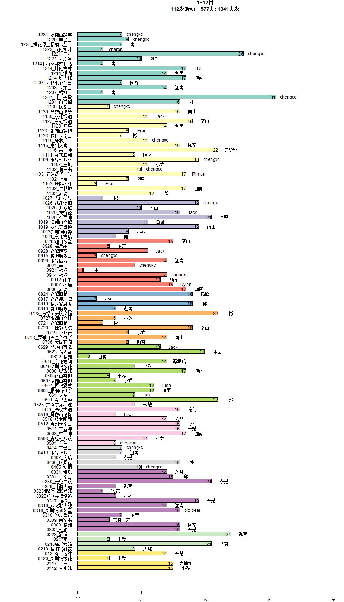

### init environment

```{r, echo=FALSE, message=FALSE}
# load library
suppressPackageStartupMessages(library(xlsx))  # Reading xlsx
suppressPackageStartupMessages(library(RColorBrewer)) # Select color set
suppressPackageStartupMessages(library(scales))  # adjust color transparent
suppressPackageStartupMessages(library(igraph))  # network graph
options(stringsAsFactors = FALSE)

# set global variable
fileName = "2019_activities.xlsx"
networkDir = "Interaction"
graphDir = "Figure"
# display.brewer.all()  # show all color panel
colours = RColorBrewer::brewer.pal(12,"Set3")

# create dir
suppressWarnings(dir.create(networkDir))
suppressWarnings(dir.create(graphDir))
```

### Prepare Data

#### Read Data
```{r, echo=FALSE, message=FALSE}
# read data
rawData = lapply(12:1, function(i){
  raw = read.xlsx2(file=fileName, sheetIndex=i, header=T)
  f1 = apply(raw, 2, function(s){mean(s=="")}) # remove invalid column
  raw = raw[1:60, f1!=1,drop=FALSE]
  # assign each month a unique color
  col = rep(colours[i],ncol(raw))
  list(raw=raw, col=col)
})
data = do.call(cbind, lapply(rawData, function(cl){cl$raw}))
col = do.call(c, lapply(rawData, function(cl){cl$col}))
# filter row
f2 = apply(data, 1, function(s){mean(s=="")})
data = data[f2 != 1, ]
# correct column name
colnames(data) = sapply(colnames(data), function(s){
  unlist(strsplit(s,split="2019"))[2]
})

# explore data
head(data)
```

#### corrected person name
```{r, echo=FALSE, message=FALSE}
  data[data=="Joy"] = "joy"
  data[data=="YanshuZhang"] = "yanshu"
  data[data=="YanshuzhangDF"] = "yanshu"
  data[data=="黄婉Ency"] = "黄婉"
  data[data=="木禾伊一"] = "尹一"
  data[data=="木禾尹一"] = "尹一"
  data[data=="Sherry"] = "sherry"
```

### Activity Summary
```{r, echo=FALSE, message=FALSE}
v = unlist(data); v=v[v!=""]  # 总活动人次
Numbers = apply(data, 2, function(s){sum(s!="")})  #每月活动人次
```
### 活动统计
```{r, echo=FALSE, message=FALSE}
jpeg(paste(graphDir,"Summary.jpeg",sep="/"), height=1680, width=960, quality=100)
  par(mai = c(0.42,3,0.82,0.42))
  a = barplot(Numbers, main=sprintf("1~12月\n%d次活动；%d人; %d人次",
                                    ncol(data),length(unique(v)),sum(Numbers)),
              xlab="人数", las=2, col=col, horiz=TRUE, cex.lab=0.2, xlim=c(0,40))
  text(y=a, x=Numbers, labels = Numbers, col="black", adj=c(1,0.5))
  text(y=a, x=Numbers+2, labels=data[1,])
  dev.off()
```


#### 个人统计

##### 每人参加活动次数
```{r, echo=FALSE, message=FALSE}
# 统计
# person
freq = sort(table(v), decreasing=TRUE)
result = lapply(names(freq), function(s){
  flag = apply(data, 2, function(x){
    s %in% x
  })
  act = colnames(data)[flag]
  act = paste(act, collapse = "; ")
  act
})
result = unlist(result)
names(result) = names(freq)
# print result
result.df = data.frame(姓名=names(result), 活动=result)
rownames(result.df)=1:nrow(result.df)
result.df
```
```{r, echo=FALSE, message=FALSE}
# 作图
freq.v = freq[length(freq):1]
names(freq.v) = paste(length(freq.v):1, names(freq.v), sep="  ")
jpeg("Figure/personActivities.jpeg", height=10000, width=1024, quality=100)
par(mai = c(0.42,2,0.82,3))
b = barplot(freq.v, ylab="times", las=2,
        cex.lab=0.2, xlim=c(0,80), horiz=TRUE)
text(y=b, x=freq.v, labels = freq.v, col="black",adj=c(1,0.5))
text(y=b, x=freq.v+2, labels=result[length(result):1], pos=4, cex=0.9)
dev.off()

```

